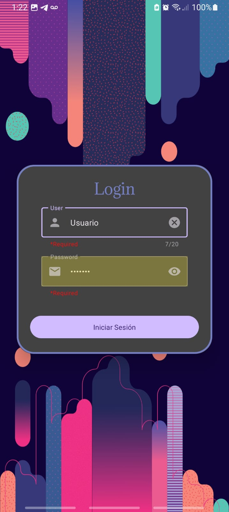
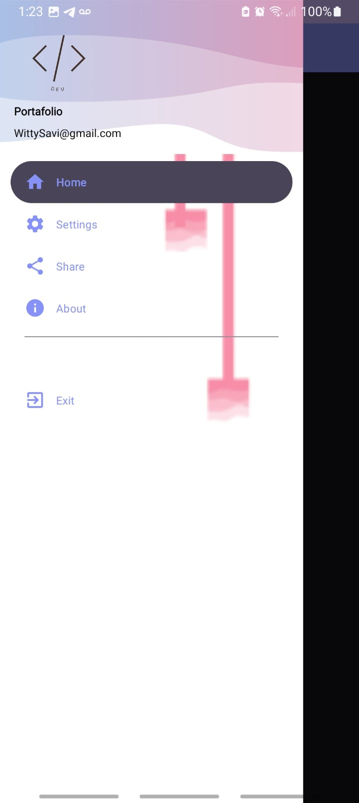
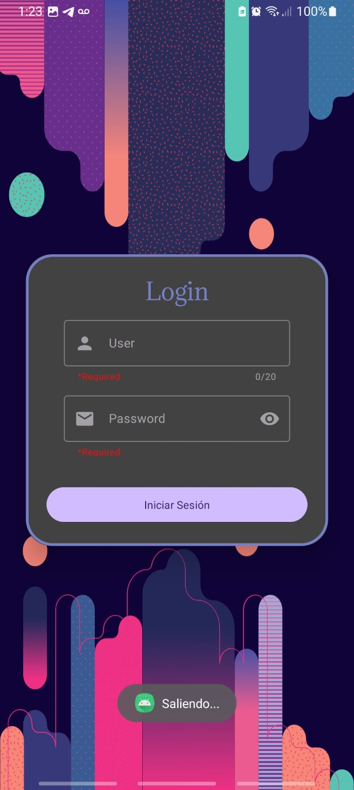

# login_Kotlin
Is a login create wih kotlin using Android Studio

## Installation

1. Clone the repository ir downloand .zip:
   ```bash
   https://github.com/AlvinRHD/login_Kotlin.git
   ```
2. Open the project in Android Studio.
3. Build and run the app on an Android emulator or devices.


## Using
| Loading Screen | Login Screen | Home Screen |
|:--------------:|:------------:|:-----------:|
| |  |  |


| Toolbar | Exit |
|:--------------:|:------------:|
| |  |


